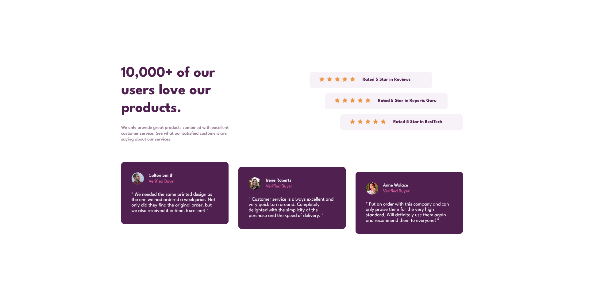

# Frontend Mentor - Social proof section solution

This is a solution to the [Social proof section challenge on Frontend Mentor](https://www.frontendmentor.io/challenges/social-proof-section-6e0qTv_bA). Frontend Mentor challenges help you improve your coding skills by building realistic projects. 

## Table of contents

- [Overview](#overview)
  - [The challenge](#the-challenge)
  - [Screenshot](#screenshot)
  - [Links](#links)
- [My process](#my-process)
  - [Built with](#built-with)
  - [What I learned](#what-i-learned)
  - [Continued development](#continued-development)
- [Author](#author)


## Overview

### The challenge

Users should be able to:

- View the optimal layout for the section depending on their device's screen size

### Screenshot




### Links

- Solution URL: [https://github.com/bugvlopper/FrontednMentor-social-proof.git](https://github.com/bugvlopper/FrontednMentor-social-proof.git)
- Live Site URL: [https://bugvlopper.github.io/FrontednMentor-social-proof](https://bugvlopper.github.io/FrontednMentor-social-proof)

## My process

### Built with

- JSX
- CSS custom properties
- Flexbox
- Mobile workflow (I'm still doing my  mobile design after the desktop it's easyier for me to structure my work )
- [React](https://reactjs.org/) - JS library


### What I learned

I learned to use component in better way than before

exemple:

```js
<div className="bottom-container">
            {data.map((data, index)=> <Card key={index} data={data}/>)}
</div>
```
More i practice more i want to learn ! x) Let's see what i can do in the next challenge ! ;) 

### Continued development

I'm still in progress with using react, i start to understand the power of components and recursivity of react.

## Author

- Frontend Mentor - [@bugvlopper](https://www.frontendmentor.io/profile/bugvlopper)


